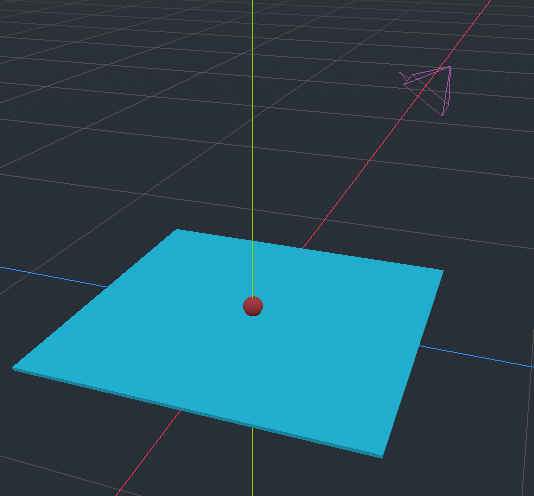

# Godot Coding 

Collection of godot building blocks useful for building games!

## Projects

### 2D Movement In 3D World

Version: `Godot_v3.4.4-stable_x11` (Ubuntu)

Project directory: `2DMovementIn3DWorld/`

Idea: base code for moving object on plane in 3D scene.

Notes: code is based on CatLike coding tutorial: https://catlikecoding.com/unity/tutorials/movement/sliding-a-sphere/

